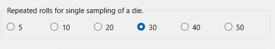
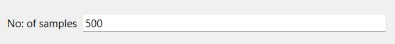

# Visualize the Central limit Theorem of die.

## To Get Started

### Python > 3.5 is a recommended.
Install typing module to avoid run time failures if you are below 3.5.

### Altering the source code. Steps as follows.
1) Open the command prompt or the shell depending upon your os.
2) Copy and run the following command ``pip install -r requirements.txt`` from Cloned folder as root in the shell or cmd.
3) If it is not successfully installed run ``pip install matplotlib PyQt6``.
4) Once installed, you need to run the **root.py** has it is the main file where Qt application starts.
5) You should potentially see a GUI, follow the instructions as per GUI. Process will be explained below.
6) You could freely mess around code and have fun.
7) If there is any issue, please PR.

### Installing via dist zip folder (Recommended).

***You can just install dist of your own os alone. Not needed to clone the entire project***

### For windows 
1) Extract the zip `executables/windows/dist.zip` folder by Winzip or 7zip; any extraction software.
2) Once extracted open the exe file ``/dist/root/Central Limit Theorem of a die.exe``. 
3) You are now in Python GUI.
4) Also given `root.spec.windows` in the pulled code, if you familiar with `pyinstaller` which can be installed by `pip install pyinstaller` .After installation, you could rebuild the dist directory by running `pyinstaller root.spec`, remove concatenated os name from the spec file you are going to run. I.e) **root.spec.windows => root.spec** 

### For linux
1) Extract the zip `executables/linux/dist.zip` folder by zip(inbuilt or apt install zip -y); any extraction software.
2) Once extracted open the exe file ``/dist/root/Central Limit Theorem of a die``. 
3) You are now in Python GUI.
4) Also given `root.spec.linux` in the pulled code, if you familiar with `pyinstaller` which can be installed by `pip install pyinstaller` .After installation, you could rebuild the dist directory by running `pyinstaller root.spec`, remove concatenated os name from the spec file you are going to run. I.e) **root.spec.linux => root.spec** 

### Introduction 

The App is created to prove the central limit theorem.

#### What is Central limit theorem?
>As the sample size increases, the sampling distribution
>of the mean, , can be approximated by a normal distribution with mean µ and standard deviation σ/√n where:
    > 1) µ is the population mean,
    > 2) σ  is the population standard deviation,
    > 3) n is the sample size.

In lay man terms the any non - gaussian(normal) distribution can be approximated to normal distribution by plotting the average of sampling from original population (random variable X.) 

This app plots the mean for samples of die, thus proving a non-gaussian(normal) distribution forms the normal(bell) curve by sampling the original random variable.

### Workings of code.

    

- Asks you to select the number of rolls need to be considered for each sample.

    

- Sample count that should be considered. How many times the average of the rolls rolled is relatively called sample here.

There will be a Process button to produce graph of normal distribution and info about it.

You can process various combination, and each combination is appended at the end.

### Folder structure and its contents.
1) ``executable/`` : Contains the executable of the app of linux and windows.
2) ``HelperClass``: Contains the Qt widget code to increase reusability.
3) ``requirements.txt``: Contains the modules that should be installed.
4) ``root.spec``: Spec File created by PyInstaller.
   
# MADE WITH LOVE ❤️.                     

